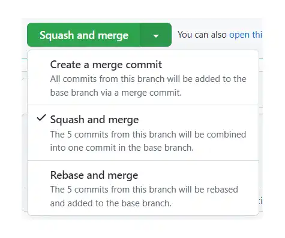

# Mobi-Js-Algomobi-Season-2

### 모비1기 알고리즘 스터디 레퍼지토리입니다😊

<br>

## 참여자

<table>
    <tr>
        <td>
        <a href="https://github.com/zivivle">
            
        </a>  
        </td>
        <td>
        <a href="https://github.com/JeongwooHam">
            
        </a>
        </td>
        <td>
        <a href="https://github.com/Jihyeong00">
            
        </a>
        </td>
    </tr>
    <tr>
    <th>
      Zoey
    </th>
    <th>
      Jane
    </th>
    <th>
      Zero
    </th>
  </tr>
</table>

## 1) 운영 방식

- 주 1회 비대면 모임 (매주 모임시 다음 주 시간을 정합니다.)
- 하루 문제풀이를 진행하지 못할시 벌금 3천원이 누적이 됩니다.
- 벌금은 n(인원수) \* 20000 만큼 모일시 회식을 진행합니다.

## 2) **매일 같이** 문제를 푸는 습관을 기릅니다.

> 매일 같이 초심을 잃지 않고 문제를 풀기 위한 스터디입니다. 하루 면제권(자유)
>
> 다른 날짜의 문제를 미리 풀이하였거나, 하루에 많은 문제를 풀이하였다고 하여 생기는 혜택은 없습니다.

- [프로그래머스](https://school.programmers.co.kr/learn/challenges?order=recent&page=1&languages=javascript) : 레벨 1이하 2문제 | 레벨 2이상 1문제
- [백준](https://www.acmicpc.net/) : 실버 이하 2문제 | 골드 이상 1문제

## 3) 진행 가이드

### 주의사항

> 모두가 다같이 사용하는 저장소인 만큼 컨벤션을 지킵니다.

### 1. 해당 저장소를 clone하여 진행합니다.

> clone 명령은 github.com에 존재하는 이 저장소를 자신의 노트북 또는 PC로 복사하는 과정입니다.
>
> 깃허브에서 파일을 직접 올릴수도 있지만 코드 컨벤션을 지키기 위해 clone하여 진행하는 것을 추천합니다.

```
// 저장소를 복사하는 방법
git clone {저장소 url}
ex) git clone https://github.com/mobi-community/mobi-js-algomobi
```

### 2. 본인의 브랜치를 생성합니다.

> git은 서로 다른 작업을 하기 위한 별도의 공간을 만들기 위해 브랜치를 생성할 수 있습니다.

```
// 새로은 브랜치를 생성하는 방법
git checkout -b {본인 아이디}
ex) git checkout -b Zoey
```

### 3. 본인의 저장소(폴더)에서 진행합니다.

> 다른 사람들과의 진행과정을 달리하여 보기위해 본인의 폴더 내에서 진행합니다.

```
// clone한 폴더로 이동하는 방법
cd {저장소 아이디}
ex) cd mobi-js-algomobi/Kei
```

### 4. 문제 풀이하기

> 폴더 구조는 다음과 같이 진행합니다. **파일명을** 참고해주세요

```
/{본인 닉네임}/{주차}/{문제명}

/Zero/week_1/가장-많이-받은-선물.js
```

> 문제를 풀이하기 이전 알고리즘을 먼저 생각하여 해당 문제를 풀이하기 이전에 문제를 이해를 하였는지 생각해봅니다.

```javascript
ex)
/**
알고리즘 생각하기

1. for문으로 room_number를 하나씩 불러온다.
2. while문을 씌운다.
3. (if)현재 값이 해시에 값이 없는지 확인한다.
4. (true)해시에 값이 없다면, 배정되지 않은 방이라는 의미이미로, 해시에 값을 (현재 방번호 : 현재 방번호 + 1)와 같이 추가한다.
5. 임시리스트에 저장된 배열이 있다면, 해당 값들을 불러와 다음방번호를 현재 방번호 + 1로 전부 바꿔준다.
6. (break)while문을 탈출한다.
7. (else)해시에 값이 있으면, 배정된 방이므로, 현재 방번호를 해시에 접근하여 다음 방번호를 얻어온다. 또한, 현재 방번호를 임시리스트에 저장한다.
*/

// 문제풀이

function find(number, room) {
    if(!room.has(number)) {
        room.set(number, number+1);
        return number
    }
    let p = find(room.get(number), room);
    room.set(number, p + 1);
    return p;
}

function solution(k, room_number) {
    const answer = [];
    const room = new Map();

    room_number.forEach(number => {
        answer.push(find(number, room))
    });

    return [...answer];
}
```

매일 같이 문제를 풀이한 후 커밋 컨벤션은 다음과 같습니다.

```
[프로그래머스] {문제명} / {레벨} / {걸린시간}
[백준] {문제명} / {레벨} / {걸린시간}

ex) [프로그래머스]/호텔방배정/level-4/45분
```

### 5. 한번에 Pull Request 요청하기

> 비대면 모임 이전 해당 주에 진행했던 문제들을 한번에 pull request 요청을 합니다.

Pull Request Title 컨벤션은 다음과 같습니다.

```
[1주차] Jane 문제풀이 완료 7/7
```

> Squash Merge를 통하여 기존에 작성했던 커밋들을 하나로 통합하여 진행합니다.
>
> 해당 Merge를 통해 커밋의 수가 여러개로 되는 것이 아닌 하나로 관리 할 수 있습니다.

<p align="center">
    
</p>

### 6. 비대면 모임

> 비대면 모임때는 해당 풀이했던 알고리즘에 대한 질문이나 사고방식에 대한 지식공유를 진행합니다.
>
> PR템플릿을 통해 질문할 내용이라던지, 더 나은 방법은 없는지 작성할 수 있습니다.
